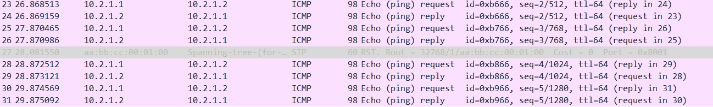

# TP2 : Network low-level, Switching

## I. Simplest setup

🌞 Mettre en place la topologie ci-dessus

🌞 Faire communiquer les deux PCs

- avec un ping qui fonctionne   

```
PC1> ping 10.2.1.2
84 bytes from 10.2.1.2 icmp_seq=1 ttl=64 time=0.466 ms
84 bytes from 10.2.1.2 icmp_seq=2 ttl=64 time=0.694 ms
84 bytes from 10.2.1.2 icmp_seq=3 ttl=64 time=0.611 ms
84 bytes from 10.2.1.2 icmp_seq=4 ttl=64 time=0.682 ms
84 bytes from 10.2.1.2 icmp_seq=5 ttl=64 time=0.677 ms   
```


- déterminer le protocole utilisé par ping à l'aide de Wireshark   

